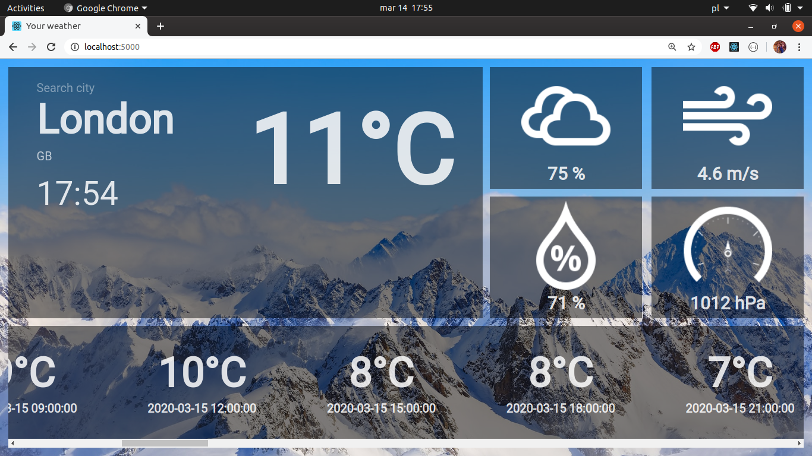
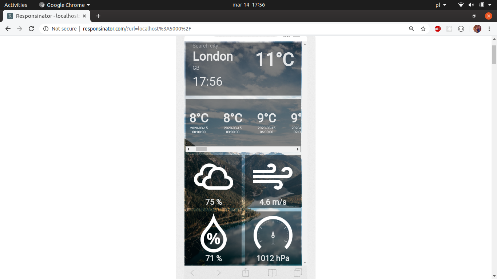

## What is this app?

It's very simple weather app, where you can check weather by city. It shows temperature with timestamps for next 5 days, pressure, wind speed and humidity. 

I made this app to for some reasons://
  *Simple block layout was a good way to try CSS Grid instead of building another flexbox layout./
  *I wanted to befriend with React Context API./
  *Sass training and try BEM./
  

# Getting started

Just clone this repository, then run "npm install" to download required packages.
With "npm start" you can start this app on localhost.

# Api key
This app is based on Openweathermap.
You have to pass your own Openweathermap's API key in src/helpers/weatherApi.js.

There is no commits from building process, because there was my Api key, that i can't share in public. 
I just forgot to move it to another file and add to .gitignore, but in next apps I'm gonna do this correct!

## Screenshots

